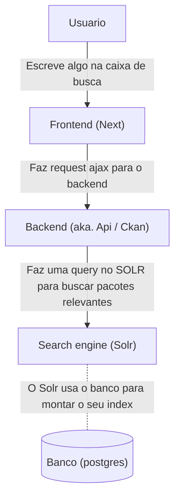

# [basedosdados.org](http://basedosdados.org) 

## Para desenvolvimento local

### Caso Primeira Vez

- Instale docker, docker-compose, git-lfs (instruções em [git-lfs.github.com](https://git-lfs.github.com/));
- Execute `./bootstrap.sh`;
- Acesse localhost;

### Outras Vezes

- Execute `docker-compose up`;
- Acesse localhost;

### Login

É possível também logar com o usuário `dev` e senha `12345678`. Note que o script `bootstrap.sh` inicializa o ambiente dev, caso tenha algum problema é possível inicializar do zero (com novos downloads e builds) com `./bootstrap.sh full`. Caso precise, a chave de API do ckan em desenvolvimento se encontra em `configs/ckan-dev-api-token.sh`, e para adicionar as suas variáveis de ambiente rode `source configs/ckan-dev-api-token.sh` ou adicione ao seu `bashrc`.

### Banco de dados

É possível visualizar e modificar o banco de dados (com dbeaver) em:

```
host:localhost
port:5432
database:ckan
user:ckan
password:ckan
```

## Para deploy do site

O deploy é feito via github actions, basta pushar na master. Se você adicionar variáveis de ambiente secretas em prod, vai ter que atualizar o arquivo .env.prod no github actions! Basicamente rodamos o `./deploy.sh`, que é um script com várias partes. Você pode rodar manualmente (desde que tenha permissão, claro) uma das partes, passando-a como argumento, como `./deploy.sh restart_services`.

De forma análoga é possível fazer o deploy do site staging, pushando na branch develop. Neste caso a variável de ambiente `BD_ENVIRON` tem valor `STAGING`, ao invés de `PROD`. Essa variável fica disponível para todas as aplicações não dockerizadas.

## Para configurar o SSH

Note que você precisará ter configurado o seu ~/.ssh/config local para acessar as máquinas do base dos dados. Para isso edite (ou crie) `~/.ssh/config` e adicione as seguintes linhas, (modificando o path, lógico):

```ssh_config
HOST bd-s staging.basedosdados.org
    HostName staging.basedosdados.org
    User ec2-user
    IdentityFile /path/para/sua/chave/privada
HOST bd basedosdados.org
    HostName basedosdados.org
    User ec2-user
    IdentityFile /path/para/sua/chave/privada
```

Para dar permissão a novos usuários para terem acesso às máquinas de `staging` ou `prod`, é preciso alguém (1) adicionar o usuário no IAM da AWS, e (2) adicionar a chave ssh pública da pessoa no arquivo `~/.ssh/authorized-keys`.

## Pasta `ckanext-basedosdados`

O plugin da Base dos Dados mora em `ckanext-basedosdados/ckanext/basedosdados`. Consulte este [README.md](ckanext-basedosdados/ckanext/basedosdados/README.md).

## Pasta `configs`

### Variáveis de ambiente e docker-compose

O ambiente de dev funciona com docker-compose. Duas features do docker-compose importantes que usamos aqui:

- docker-compose suporta interpolação de variáveis usando a sintaxe `${VAR_NAME}` lendo automaticamente de um arquivo com nome `.env` no mesmo diretório do docker-compose.yaml
- docker-compose automaticamente da merge entre o arquivo docker-compose.yaml e o arquivo docker-compose.override.yaml (caso houver), e considera isso o yaml que "ta valendo"

As configurações que variam entre dev e prod ficam em variáveis de ambiente definidas no docker-compose.yaml. Idealmente colocamos no .env somente as variáveis privadas (como senhas e outros segredos) e interpolamos seu valor. Usando o .env para dev e .env.prod para prod. Outras configuracoes nao secretas que diferem entre os ambientes ficam nos arquivos docker-compose.override.yaml e prod-docker-compose.override.yaml

### Outras configurações de ambiente

Existem outros lugares com configurações dev/prod. Em `configs/` temos:

- crontab é o cron que roda em produção, fazendo backup, monitoramento e manutenção;
- ckan.ini / ckan.override.prod.ini são arquivos de configuração do ckan. No caso, o ckan.ini e usado em dev e o ckan.prod.ini é mergeado em cima dele na hora de deployar pra prod;
- nginx.conf eh o arquivo de configuração do nginx (que roda em produção);
- who.ini outro arquivo de configuração do ckan (que nunca mexemos).

## Pasta `utils`

A pasta utils contem scripts utilizados em dev e em prod para diversas coisas. Os nomes dos scripts devem ser autoexplicativos e conter comentários explicando sua razão de ser.

### Script de atualização do banco de dev a partir dos dumps de produção/staging

Você pode rodar o script em `./utils/create_dev_init_data.sh` para atualizar o arquivo './postgresql/dev_init_data.sql.gz' que contem o snapshot do banco de dev. Esse script aceita como parâmetro posicional `File`, caso não queira baixar um backup automaticamente de prod/staging, você pode passar um path com um arquivo postgres.dump. Se STAGING=1, o script vai baixar do banco de staging ao invés de produção.

Esse script requer a existência de um profile chamado `basedosdados` criado em `~/.aws/config`. Você pode pegar as variávels `aws_access_key_id` e `aws_secret_access_key` na própria AWS após criar uma `access key` em uma conta admin.

## FAQ

Soluções para perguntas e problemas recorrentes:

### 1. O que fazer quando cai o container de CKAN de produção?

1. Rodar `ssh ec2-user@basedosdados.org`.
2. Dentro da máquina de produção, rodar `docker-compose up -d ckan`.

### 2. Como atualizar o dump local do db (em `stack/postgresql/dev_init_data.sql.gz`) baseado no banco de staging?

1. Rodar `ssh ec2-user@staging.basedosdados.org`.
2. Dentro da máquina de desenvolvimento, rodar `./backup_database.sh`.
3. Da sua máquina local, rodar `utils/create-dev-init-data.sh` com `STAGING=True`.

### 3. Como acessar o banco de produção

0. Desative o seu banco local rodando `docker-compose rm -sf db`
1. Em um terminal livre rode: ssh basedosdados.org -L 5432:localhost:5432

Esse comando acima vai criar um tunnel de ssh, permitindo você acessar o banco de produção como se estivesse local

2. Use algum programa (recomendo o DBEAVER) pra conectar no banco de produção, apontando para localhost:5432.
Para conseguir as credenciais do banco, peça pra alguém que tem.

### 4. Como adicionar/promover usuários a sysadmin no CKAN

1. Entrar na máquina desejada (`prod` ou `dev`)
2. Rodar `docker-compose exec -T ckan ckan sysadmin add <user>`

Ver mais instruções [aqui](https://docs.ckan.org/en/2.9/maintaining/getting-started.html#create-admin-user).

# Arquitetura desse repositorio

## Como é o fluxo de dados do Backend

Os dados do nosso site, 

Api (ckan), Index (SOLR), DB (postgres)



A fonte de verdade fica no Banco, mas as consultas dos usuarios batem no Solr. Isso porque o solr é um servico otimizado para fazer buscas e consultas. [Documentacao do Solr](https://solr.apache.org/guide/8_11/searching.html)

O Solr depende de um Index, que é um arquivo q ele mesmo mantem. A unica coisa que a gente precisa fazer é avisar quando q ele precisa re-montar (ou atualizar) o index. Quando vc pede um reindex, o solr recria tudo a partir dos dados do banco. 

Se um usuario edita um dataset/resource pelo site, ou via api, o reindex acontece automaticamente. Se vc editar direto no banco (via uma migration SQL por exemplo), ae precisamos pedir o reindex manualmente.
