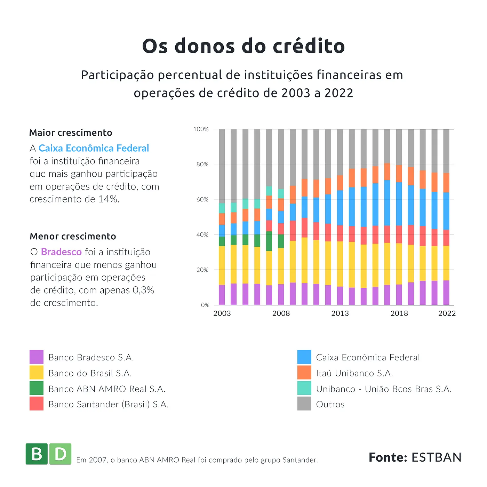

De acordo com o Instituto de Pesquisa Econômica Aplicada (IPEA), em março de 2023 o saldo total de crédito do Sistema Financeiro Nacional (SFN), medido em relação ao Produto Interno Bruto (PIB), foi de 52,9%. Isso sugere que o acesso ao crédito é cada vez mais fundamental para o financiamento de atividades econômicas, investimentos e consumo no Brasil.

Para entender um pouco melhor o cenário da oferta de crédito no país, analisamos os dados de Estatísticas Bancárias (ESTBAN), que trazem informações sobre a posição mensal dos saldos das principais rubricas de balancetes dos bancos comerciais e dos bancos múltiplos com carteira comercial, agregadas por agência bancária e atualizadas mensalmente. Você também pode acessar esses dados, já tratados e atualizados pela BD, para realizar análises econômicas, estudos de mercado, planejamento financeiro e outras finalidades relacionadas ao setor bancário e às atividades econômicas em nível municipal.

<Image src="grafico_donos_credito.webp" caption="Caption here"/>

<StorageImage src="grafico_donos_credito.webp" caption="Caption here"/>
